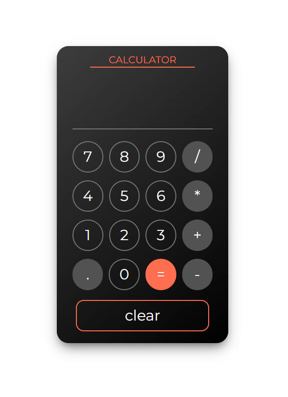
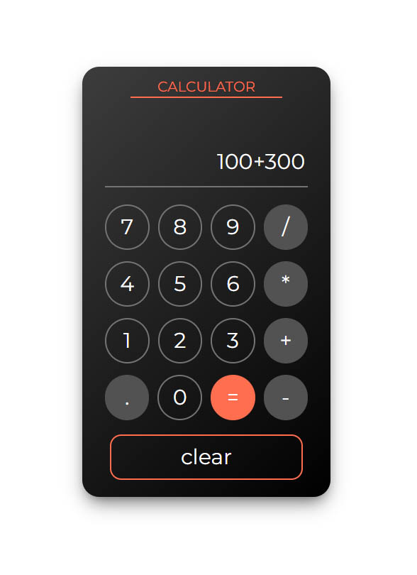

# Calculator Web App

## Features

- Basic arithmetic operations: addition, subtraction, multiplication, and division.
- Clear button to reset the calculator display.
- Responsive design that adapts to different screen sizes.

## Technologies Used

- HTML
- CSS
- JavaScript
- Tailwind CSS

## Live Demo

For live demo of Calculator &#128073; [here](https://calculator-assignment6.netlify.app/).

## Screenshots





## Installation

To run the calculator web app locally, follow these steps:

1. Clone the repository:

   ```
   git clone https://github.com/MubashirAlam89/calculator.git
   ```

2. Navigate to the project directory:

   ```
   cd calculator
   ```

3. Open the index.html file in your preferred web browser.

<hr>
made with &#128151; by <a href="https://www.mubashiralam.com">"Mubashir Alam"</a>.
